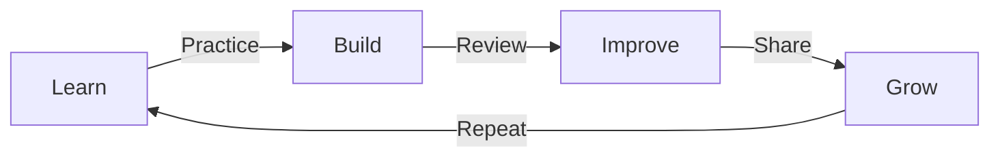

<div align="center">


[](https://git.io/typing-svg)

</div>

<div align="center">
  
[](https://github.com/krissCs)
[](https://twitter.com/krissCs)

</div>

## 🌱 My Learning Journey

```typescript
interface JuniorDeveloper {
  name: string;
  currentFocus: string[];
  learning: Technologies;
  interests: string[];
  goals: string[];
}

interface Technologies {
  frontend: string[];
  backend: string[];
  tools: string[];
}

const kristofher: JuniorDeveloper = {
  name: "Kristofher Salcedo",
  currentFocus: [
    "Building Strong Fundamentals",
    "Frontend Development",
    "Learning Backend Concepts"
  ],
  learning: {
    frontend: ["HTML", "CSS", "JavaScript", "React"],
    backend: ["Node.js", "Express", "Basic Database Concepts"],
    tools: ["Git", "VS Code", "Terminal"]
  },
  interests: [
    "Web Development",
    "User Experience",
    "Problem Solving",
    "Clean Code Practices"
  ],
  goals: [
    "Master Frontend Fundamentals",
    "Build Full-Stack Applications",
    "Contribute to Open Source",
    "Grow as a Developer"
  ]
};
```

<div align="center">

## 🛠️ Technologies I'm Learning


## 📚 Current Learning Path

- 🌱 Strengthening my JavaScript fundamentals
- 💻 Building projects with React
- 📱 Learning responsive design principles
- 🔧 Understanding backend basics with Node.js

## 🎯 Projects & Progress

<div align="center">
  
  
</div>

## 🌟 My Development Journey

<div align="center">



</div>

## 🎯 Current Focus

- 📚 Learning core web development concepts
- 🛠️ Building portfolio projects
- 🤝 Connecting with other developers
- 📝 Documenting my learning journey

## 🤝 Let's Connect!

<div align="center">

[](https://linkedin.com/in/krissCs)
[](https://twitter.com/krissCs)

<details>
<summary>✨ My Developer Philosophy</summary>
<br>

```typescript
function growAsDeveloper(): Promise<Success> {
  return new Promise(resolve => {
    while (true) {
      learn();
      practice();
      fail();
      improve();
      // Growth is a continuous journey
    }
  });
}
```
</details>

</div>

<div align="center">

### 👋 Visitors


</div>


